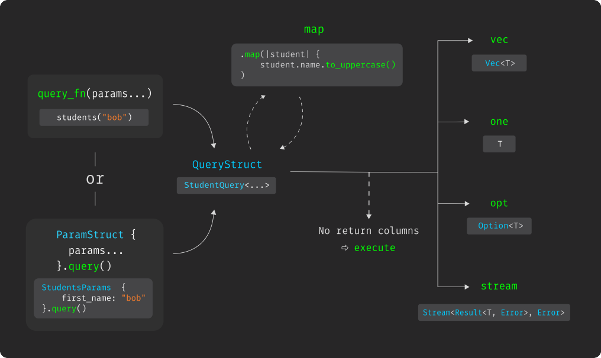

<div align="center">  </div>
<h1 align="center">Cornucopia</h1>
<div align="center">
 <strong>
   Generate type checked  Rust from your SQL
 </strong>
</div>

<br />

<div align="center">
  <!-- Downloads -->
  <a href="https://crates.io/crates/cornucopia">
    
  </a>
  <!-- Version -->
  <a href="https://crates.io/crates/cornucopia">
    
  </a>
  <!-- Github Actions -->
  
  <!-- Dependencies -->
  
  <!-- License -->
  
</div>

<div align="center">
  <h4>
    <a href="#install">
      Install
    </a>
    <span> | </span>
    <a href="examples/basic/README.md">
      Example
    </a>
  </h4>
</div>

<br />

Cornucopia is a small CLI utility resting on `tokio-postgres` designed to facilitate PostgreSQL workflows in Rust.

Cornucopia aims to get out of your way, **transpiling your PostgreSQL queries to Rust on demand**. Each query is prepared against your schema, ensuring that the query statements are valid SQL. These prepared statements are then be used to generate properly type-checked Rust code for this query.

##### Features
* SQL-first. Your database schema is the source of truth. No ORM.
* Custom user types (composites, enums and domains).
* Strongly-typed async row streams.
* Ergonomic type mapping
* One-dimensional array types.
* Nullable return columns.
* Optional migration management.
* Build your queries against your own live database, or let Cornucopia manage that for you.
* Use the connection type that you want (pooled or not, transaction or not). You can mix and match them freely.
* Compatible with `build.rs` to rebuild Rust queries whenever SQL files change.
* No macros, respects your compile times.

Keep reading for more info, or take a look at the [basic example](/examples/basic/README.md) for a quickstart 🚀.

---

## Install
### Container manager
Cornucopia spawns a `postgres` container when it generates your Rust modules, so, you'll need a working `docker` or `podman` command. **Note: If you only work in `live` mode, you may not need a container manager since you'll manage the database yourself**.

To use `docker` on Linux, **non-sudo users need to be in the docker group**. For a step-by-step guide, please read the official docker [installation](https://docs.docker.com/get-docker/) and [post-installation](https://docs.docker.com/engine/install/linux-postinstall/) docs. 

No special installation steps are needed for `podman`, but note that you will need to pass a CLI flag to cornucopia (`-p` or `--podman`) as it  defaults to `docker`.

### Dependencies
#### Required
* Runtime: `tokio`.
* Database driver: `tokio_postgres` .
* Async tools: `futures`.
* Client code: `cornucopia_client`.

#### Optional
* Pooled connections: `deadpool-postgres`. 
* Custom PostgreSQL user types: `postgres_types`.

#### Extra types using `tokio_postgres` features
| Crate        | available types                                    | `tokio_postgres` feature |
| ------------ | -------------------------------------------------- | ------------------------ |
| `serde_json` | `Value`                                            | `with-serde_json-1`      |
| `time`       | `Date` `Time` `PrimitiveDateTime` `OffsetDateTime` | `with-time-0_3`          |
| `uuid`       | `Uuid`                                             | `with-uuid-1`            |
| `eui48`      | `MacAddress`                                       | `with-eui48-1`           |

#### Full dependencies
The code block below shows what your dependencies might look like with every feature that `cornucopia` supports enabled:
```toml
# Cargo.toml
[dependencies]
tokio = { version = "1.18.1", features = ["full"] }
deadpool-postgres = { version = "0.10.2" }
postgres-types = { version = "0.2.3", features = ["derive"] }
cornucopia_client = "0.2.2"
futures = "0.3.21"
tokio-postgres = { version = "0.7.6", features = [
    "with-serde_json-1",
    "with-time-0_3",
    "with-uuid-1",
    "with-eui48-1",
] }
serde = { version = "1.0.137", features = ["derive"] }
serde_json = "1.0.81"
time = "0.3.9"
uuid = "1.0.0"
eui48 = "1.1.0"
```
You can omit `tokio-postgres` feature flags for `json`, `time`, `uuid`, `eui48` and their corresponding crates if you don't need them.

### Cornucopia CLI
Aside from the code dependencies, you will need the `cornucopia` CLI to generate your Rust modules. This can be done via a simple `cargo install cornucopia` which will pull the latest binary and install it in your `cargo` path. Note that once the queries have been generated, they build and run standalone without requiring the CLI.

## Concepts
This section explain a bit more about how Cornucopia works. If you just want to get started, you should take a look at the [basic example](examples/basic/README.md).

Cornucopia is pretty simple to use. In the next sections, we'll explore the basic usage, but feel free to look the CLI's whole interface using the `--help` option at any point. For convenience, the CLI's [reference document](cli.md) is also available in this repository.

### Migrations
The basic `cornucopia generate` command creates a new container, runs your migrations, generates your queries and cleanups the container. If you want to manage the database and migrations yourself, use the `cornucopia generate live` command to connect to an arbitrary live database. Keep in mind that your queries must still be otherwise compatible with Cornucopia (e.g. with regards to [supported types](#supported-types) and [annotation syntax](#query-annotation-syntax)).

New migrations can be added using the command `cornucopia migration new`. 

Finally, as a convenience, you can use `cornucopia migration run` to run migrations on your database too if you so desire. This feature worksfor simple cases, but is not yet thoroughly tested and it's advisable that you use a more robust migration system.

### Queries

Each `.sql` file in your queries directory will be converted into a Rust module containing your generated queries. Each query is actually prepared against your database, ensuring as many errors as possible will be caught before production. The generated functions are fully typed, giving you insight into your SQL and pretty strong guards against runtime errors.

### Generated modules
Assuming you have the following migration
```sql
CREATE TABLE Author (
    Id SERIAL NOT NULL,
    Name VARCHAR(70) NOT NULL,
    Country VARCHAR(100) NOT NULL,
    PRIMARY KEY(Id)
);
```
and the following query
```sql
--! author_name_starting_with
SELECT
    *
FROM
    Author
WHERE
    name LIKE CONCAT(:start_str::text, '%');
```
After generating your queries with `cornucopia`, you could use it like this
```rust
let authors = author_name_starting_with(client, &"Joh").vec().await?;
// Print all the authors whose name starts with "Joh"
for author in authors {
  println!("{}" author.name)
}
```
The generated code covers lot more than that, but the above should be fairly representative how you could use the generated code. Head over to the [examples](/examples/basic/) if you want to see more features in action. 

The diagram below shows a very high level representation of the items generated by Cornucopia. It's not exhaustive, but it can help you wrap your head around the generated code if you're starting out.

 </img>


### Query annotation syntax
Cornucopia supports two kinds of annotation syntaxes: PostgreSQL-compatible and extended. no matter which kind of syntax you use, Cornucopia will generate and use valid PostgreSQL statements for your queries (i.e. the extended syntax is stripped away internally).

Note that annotations are whitespace insignificant and can be split accross multiple lines too
```sql
--! authors (
--!
--! )
```
Comments that do not start with `--!` (e.g. `-- This`) are simply ignored by Cornucopia, so feel free to use them as you usually would.

#### PostgreSQL-compatible
```sql
--! example_query(first_name, last_name)
select * from authors 
where first_name = $1 and last_name = $2
```
This syntax keeps your raw queries compatible with any PostgreSQL tool.

#### Extended
```sql
--! example_query
select * from authors
where first_name = :first_name and last_name = :last_name
```
The extended syntax does not guarantee compatibility with PostgreSQL tools, but it allows you to use named parameters with the `:colon_identifier` notation. More features might be added to this syntax in the future.

#### Nullable columns
```sql
--! authors_named_john ?{name}
select name from authors 
where first_name = :first_name
```
In addition, both the PostgreSQL-compatible and extended syntaxes can accept a list of nullable columns using the `?{nullable, columns}` notation.
Column indexes are brittle, but you can use them if needed `?{nullable_column, 4}`.

### Transactions
Generated queries take a `GenericClient` as parameter, which accepts both `Client`s and `Transaction`s. That means you can use the same generated queries for both single statements and transactions.

### Connection pools
Generated queries take a `GenericClient` as parameter, which accepts both connections from `tokio-postgres` (non-pooled) and `deadpool_postgres` (pooled).

## Automatically generate queries
You can make use of Rust's build script feature to automatically regenerate your Cornucopia queries upon building your crate, only when your SQL has changed. The simplest way to achieve this is simply to call Cornucopia's CLI inside your `build.rs` file. You can learn more about this feature in this [example](examples/auto_build/README.md).

## Supported types
### Base types
| PostgrsQL type                               | Rust type                 |
| -------------------------------------------- | ------------------------- |
| `bool`, `boolean`                            | `bool`                    |
| `"char"`                                     | `i8`                      |
| `smallint`, `int2`, `smallserial`, `serial2` | `i16`                     |
| `int`, `int4`, `serial`, `serial4`           | `i32`                     |
| `bigint`, `int8`, `bigserial`, `serial8`     | `i64`                     |
| `real`, `float4`                             | `f32`                     |
| `double precision`, `float8`                 | `f64`                     |
| `text`                                       | `String`                  |
| `varchar`                                    | `String`                  |
| `bytea`                                      | `Vec<u8>`                 |
| `timestamp without time zone`, `timestamp`   | `time::PrimitiveDateTime` |
| `timestamp with time zone`, `timestamptz`    | `time::OffsetDateTime`    |
| `date`                                       | `time::Date`              |
| `time`                                       | `time::Time`              |
| `json`                                       | `serde_json::Value`       |
| `jsonb`                                      | `serde_json::Value`       |
| `uuid`                                       | `uuid::Uuid`              |
| `inet`                                       | `std::net::IpAddr`        |
| `macaddr`                                    | `eui48::MacAddress`       |

### Custom types
Cornucopia also supports user-defined `enum`s, `composite`s and `domain`s. Just like base types, custom types will be generated automatically
by inspecting your database. The only requirement for your custom types is that they be based on other supported types (base or custom).
Cornucopia is also aware of your types' namespaces (what PostgreSQL calls schemas), so it will correctly handle custom types like `my_schema.my_custom_type`.

### Array types
Cornucopia supports one-dimensionnal arrays for which the element type is also a type supported . That is, Cornucopia supports `example_elem_type[]` if `example_elem_type` is itself a type supported by Cornucopia (base or custom).

## MSRV
This crate uses Rust 2021 edition, which requires at least version 1.56.

## License

Licensed under either of
 * Apache License, Version 2.0 ([LICENSE-APACHE](LICENSE-APACHE) or http://www.apache.org/licenses/LICENSE-2.0)
 * MIT license ([LICENSE-MIT](LICENSE-MIT) or http://opensource.org/licenses/MIT)
at your option.

### Contribution

Unless you explicitly state otherwise, any contribution intentionally submitted
for inclusion in the work by you, as defined in the Apache-2.0 license, shall be dual licensed as above, without any
additional terms or conditions.